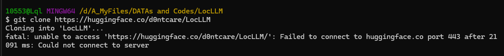
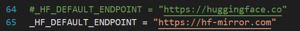
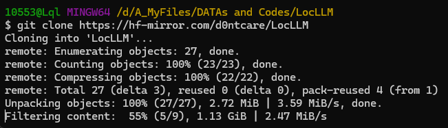

# huggingfece 无法连接的问题

## 登录huggingface(使用token的方法)
## maybe optional

## 连接问题

### 1.首先安装huggingface_hub

    pip install huggingface_hub
    
### 2.在虚拟环境中找到constants.py

anaconda3/envs/<env_name>/Lib/site-packages/huggingface_hub/constants.py

修改镜像的地址为下面的地址：

然后就可以成功下载了：

